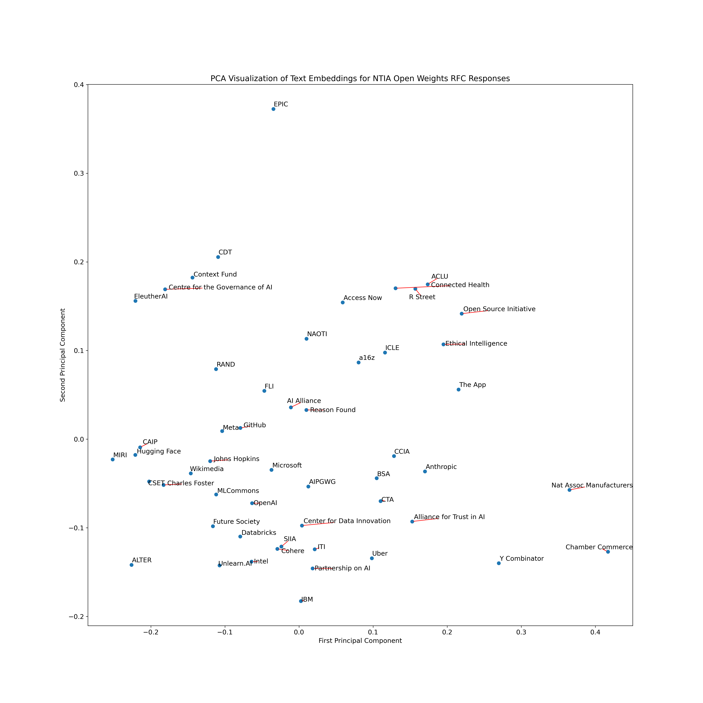

## Comments on the NTIA Open Weights RFC

National Telecommunications and Information Administration (NTIA) issued request for comments (RFC) on the Dual Use Foundation Artificial Intelligence Models With Widely Available Model Weights - see the official request [here](/docs/NTIA-2023-0009-0001_RFC.pdf).

#### Contents of this repository

The [comment metadata file](./comment_metadata.json) includes the commenters, the IDs of the comments, and whether the commenter is an organization or not. The comments from selected organizations (companies, non-profits, etc.) are available in the [docs](/docs/) folder. These PDF documents were converted to text using [pymupdf](https://pymupdf.readthedocs.io/en/latest/) and saved in the [texts](/texts/) folder.

#### Why

CF's suggestion to visualize the embeddings of the publicly available comments - [tweet](https://twitter.com/CFGeek/status/1775620689388773662).

#### Visualization

- Split each document into smaller chunks
- Compute embeddings using `text-embedding-3-large`
- Aggregate embeddings for each commeter by averaging the chunk embeddings
- Visualize the embeddings using PCA
- N=52 (51 organizations + CF)

